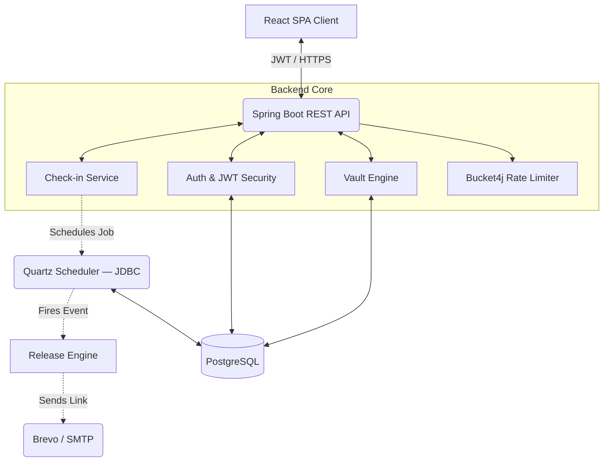

<div align="center">


<br/>

[](https://spring.io/)
[](https://reactjs.org/)
[](https://www.postgresql.org/)
[](LICENSE)

*Secure your digital assets. Automate your legacy. Rest easy knowing your loved ones are covered.*

---

</div>

## 📖 Overview

**SafeKeep** is a highly secure, automated **Digital Dead Man's Switch**. It empowers users to store critical information — passwords, seed phrases, final instructions, personal documents — inside an AES-256-GCM encrypted vault with a dual-key envelope architecture.

Users configure a **check-in interval** (e.g., every 30 days). If they fail to check in, SafeKeep automatically assumes incapacitation and securely triggers the release of specific vault items to pre-designated trusted recipients via encrypted, timed-access links.

---

## 🔐 Security Architecture

SafeKeep uses a **dual-key envelope encryption** model. Here is an exact description of what is built — no marketing inflation.

### Encryption Model

```
Password + random 256-bit salt
        │
        ▼
  Argon2id (64MB RAM cost, 4 iterations, p=2)
        │
        ▼
  User Master Key (256-bit)
        │
        ├──── encrypts ────► Encrypted DEK (stored in DB)
        │
Server Secret + per-item server salt
        │
        ▼
  Argon2id (same parameters)
        │
        ▼
  Server Master Key (256-bit)
        │
        ├──── encrypts ────► Encrypted DEK (server copy, stored in DB)
        │
Random 256-bit DEK (never stored raw)
        │
        ├──── encrypts ────► Vault content ciphertext (AES-256-GCM)
        └──── encrypts ────► Encrypted file attachments (AES-256-GCM)
```

### What a Database Breach Reveals

**Nothing useful.** A full PostgreSQL dump contains only:
- Ciphertext blobs (AES-256-GCM encrypted — computationally infeasible to brute-force)
- Encrypted DEKs (also ciphertext — require either the user's password or the server secret to unwrap)
- Argon2id salts (public by design — useless without the password)

Decrypting vault content requires **either**:
- **(a) The user's vault password** — used for live vault access (never stored, never logged)
- **(b) The server secret** — used exclusively by the scheduler for automated recipient release (never sent to clients, stored only in environment variables)

### Honest Limitations

> The vault password is currently verified **server-side** (sent in an encrypted HTTPS request header). This means the server sees the password during vault operations — it is not zero-knowledge in the strictest sense.
>
> **Phase 2 Complete:** Key derivation and encryption happen entirely in the browser using WebCrypto and hash-wasm. The vault password never leaves the browser.

### Forgotten Vault Password Policy

**If you forget your vault password, your vault data is permanently unrecoverable.** This is a deliberate security property: since vault keys are derived from your password and are never stored on the server, there is no recovery backdoor. Keep your vault password somewhere safe (e.g., in your device's password manager).

---

## ✨ Features

| 🔒 Envelope Encryption | ⏱️ Fault-Tolerant Scheduler | 🛡️ Rate Limiting |
| :--- | :--- | :--- |
| **AES-256-GCM** with per-item random DEK. Dual-envelope: one key for user access, one for automated release. | **Quartz JDBC** job store persists scheduled jobs across server restarts. Jobs survive crashes. | **Bucket4j** token-bucket limiting on all auth and vault endpoints. Login: 10/15min per IP. |

- 📜 **Immutable Audit Trail**: Every login, check-in, vault access, and status transition is logged with IP, actor, and timestamp.
- 🗂️ **File Attachments**: Upload files (up to 10MB) — encrypted with AES-256-GCM before storage.
- 📧 **Progressive Reminders**: Escalating email notifications at 24h, 20h, 15h, 10h, 5h, 1h before deadline.
- 🌐 **Timezone Resilient**: UTC-to-local conversion ensures accurate countdown timers globally.
- 🔗 **Timed Release Links**: Recipients receive expiring (72h) access tokens — links auto-expire after delivery.

---

## 🏗️ System Architecture



---

## 🚀 Quick Start

### Prerequisites
- **Java 21+**
- **Node.js 20+**
- **PostgreSQL 14+**

### 1. Database Setup
```sql
CREATE DATABASE safekeep;
CREATE USER safekeep_user WITH PASSWORD 'YOUR_DB_PASSWORD';
GRANT ALL PRIVILEGES ON DATABASE safekeep TO safekeep_user;
```

### 2. Backend
```bash
cd backend
cp src/main/resources/application.properties.example src/main/resources/application.properties
# Fill in DB credentials, JWT secret, Brevo API key, and release token secret
./mvnw spring-boot:run
```
> API available at `http://localhost:8080`. Interactive docs at `/swagger-ui.html`.

### 3. Frontend
```bash
cd frontend
npm install
npm run dev
```
> App available at `http://localhost:5173`.

### Docker Compose (optional)
```bash
docker-compose up -d
```

---

## 📁 Repository Structure

```text
safekeep/
├── backend/                       # Spring Boot Application
│   ├── src/main/java/             # Domain, Controllers, Services, Security
│   │   └── com/safekeep/backend/
│   │       ├── config/            # Security, CORS, Quartz, Rate Limiting
│   │       ├── controller/        # REST endpoints
│   │       ├── entity/            # JPA entities
│   │       ├── scheduler/         # Quartz jobs + email notifications
│   │       ├── service/           # Business logic
│   │       └── util/              # AesEncryptionUtil (Argon2id + AES-256-GCM)
│   ├── src/main/resources/
│   │   └── db/migration/          # Flyway migrations (V1–V13)
│   └── pom.xml
├── frontend/                      # React Application (Vite)
│   ├── src/api/                   # Axios client
│   ├── src/components/            # Reusable UI components
│   └── src/pages/                 # Dashboard, Vault, Recipients, Settings
├── THREAT_MODEL.md                # Attack surface analysis
└── docker-compose.yml
```

---

## 🗺️ Roadmap

- [ ] **Client-side zero-knowledge encryption** — key derivation via `hash-wasm` (Argon2id in WASM) + `crypto.subtle` (AES-256-GCM) entirely in the browser; server will never see plaintext or the vault password
- [ ] **Vault key rotation** — re-wrap DEK when vault password changes, without re-encrypting content
- [ ] **Integration test suite** — Testcontainers + full vault-create → release flow
- [ ] **CI pipeline** — GitHub Actions on every push
- [ ] **Recovery key** — optional 256-bit recovery code shown once at signup

---

## 🤝 Contributing

Contributions, issues, and feature requests are welcome. See the [issues page](https://github.com/Siddharth7880/SafeKeep/issues).

<div align="center">
  
</div>
