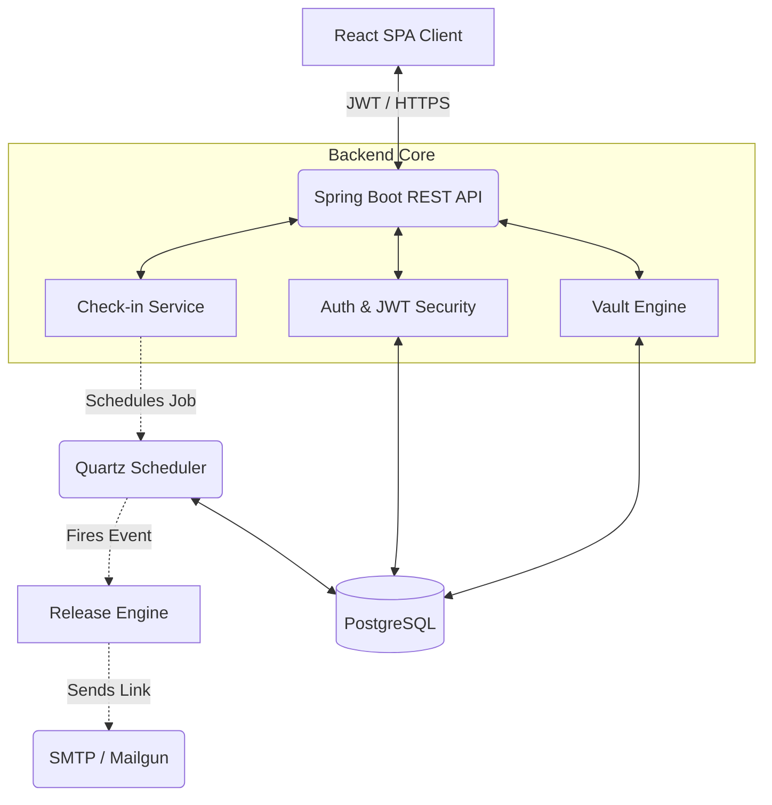

<div align="center">

# 🛡️ SafeKeep

**The Ultimate Digital Dead Man's Switch & Secure Legacy Platform**

[](https://spring.io/)
[](https://reactjs.org/)
[](https://www.postgresql.org/)
[](https://opensource.org/licenses/MIT)

*Secure your digital assets. Automate your legacy. Rest in peace knowing your loved ones are covered.*

---

</div>

## 📖 Overview

**SafeKeep** is a highly secure, automated "Digital Dead Man's Switch". It empowers users to store critical information—like passwords, seed phrases, final instructions, and personal documents—in a heavily encrypted zero-knowledge vault. 

Users configure a **check-in interval** (e.g., every 30 days). If a user fails to check in, SafeKeep automatically assumes incapacitation and securely triggers the release of specific vault items to pre-designated trusted recipients via encrypted, timed-access links.

## ✨ Premium Features

| 🔒 Zero-Knowledge Security | ⏱️ Automated Legacy Release | 🎨 Modern Architecture |
| :--- | :--- | :--- |
| **AES-256 Encryption** with Argon2id key derivation. Your vault password never leaves your browser. | **Quartz Scheduler** powered exact-time triggers automatically notify recipients if you fail to check in. | **Glassmorphism UI** built with React & Framer Motion. Backend powered by Spring Boot & PostgreSQL. |

- 🛡️ **Rate-Limited API**: Protected by Bucket4j to prevent brute-force attacks.
- 📜 **Immutable Audit Trail**: Every login, check-in, and vault access is logged and visible.
- 🗂️ **Secure Attachments**: Support for uploading and encrypting files (up to 10MB) directly in the browser.
- 🌐 **Timezone Resilient**: Complex UTC-to-Local conversion ensures accurate countdown timers globally.

## 🏗️ System Architecture

SafeKeep is built with a decoupled microservice-ready architecture.



## 🚀 Quick Start Guide

### Prerequisites
- **Java 21+**
- **Node.js 20+**
- **PostgreSQL 14+**

### 1. Database Setup
```sql
CREATE DATABASE safekeep;
CREATE USER safekeep_user WITH PASSWORD 'YOUR_DB_PASSWORD';
GRANT ALL PRIVILEGES ON DATABASE safekeep TO safekeep_user;
```

### 2. Backend Initialization
```bash
cd backend
# Create environment configuration
cp src/main/resources/application.properties.example src/main/resources/application.properties

# Run the Spring Boot Server (Auto-migrates DB via Flyway)
./mvnw spring-boot:run
```
> The API will be available at `http://localhost:8080`. View the interactive OpenAPI docs at `/swagger-ui.html`.

### 3. Frontend Initialization
```bash
cd frontend
npm install
npm run dev
```
> The application will be available at `http://localhost:5173`.

## 📁 Repository Structure

```text
safekeep/
├── backend/                  # Spring Boot Application
│   ├── src/main/java/        # Domain, Controllers, Services, Security
│   ├── src/main/resources/   # App Config, Flyway Migrations, Thymeleaf Templates
│   └── pom.xml               # Maven Dependencies
├── frontend/                 # React Application
│   ├── src/api/              # Axios Interceptors & API Clients
│   ├── src/components/       # Reusable UI Components
│   ├── src/pages/            # View Layer (Dashboard, Vault, Settings)
│   └── package.json          # Node Dependencies
└── docker-compose.yml        # Infrastructure provisioning
```

## 🤝 Contributing
Contributions, issues, and feature requests are welcome! Feel free to check the [issues page](https://github.com/Siddharth7880/SafeKeep/issues). 

Please read the `CONTRIBUTING.md` (coming soon) for details on our code of conduct, and the process for submitting pull requests.

## 📜 License
This project is licensed under the MIT License - see the `LICENSE` file for details.
